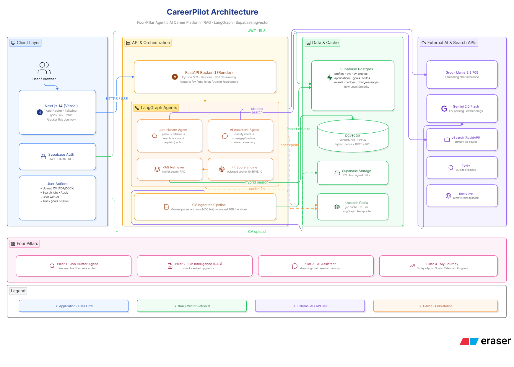

# CareerPilot

CareerPilot is an agentic career co-pilot for Codesprint 2026. It hunts jobs, scores fit against a user's real CV, drafts personalized guidance, and keeps the user's daily career work organized in one place.

Built on a free-tier stack. No paid APIs. No credit card.

## What It Does

- Job Hunter Agent: searches live roles, scores them programmatically against the user's CV, and returns structured cards with fit explanations, source links, salary/deadline fields, and save-ready metadata.
- CV Intelligence: parses PDF and DOCX CVs, chunks them by section, embeds them with Gemini, and stores them in Supabase pgvector for retrieval across the product.
- AI Assistant: streams grounded career advice with session memory, CV retrieval, and Copilot-style actions such as opening routes, pre-filling search boxes, drafting goals/tasks, and preparing application notes for review.
- My Journey: gives the user a daily workspace with Today, Applications, Goals & Tasks, Calendar, and Progress views, all tied to real tracker data and proactive nudges.

## Product Map

| Route | Visible label | Purpose |
| --- | --- | --- |
| `/tracker` | My Journey | Main authenticated workspace |
| `/jobs` | Jobs | Live job search and fit scoring |
| `/chat` | AI Assistant | Streaming CV-grounded assistant |
| `/cv` | Profile | CV upload, parsing, and editable profile intelligence |
| `/cv/preview` | Resume Preview | Printable resume preview built from the saved profile |
| `/` | Redirect | Sends authenticated users to `/tracker` |

## Why It Stands Out

- The user's CV is the source of truth for scoring, advice, and drafts.
- Fit scores are computed programmatically, not guessed by the LLM.
- Chat is streamed token-by-token from Groq with session memory in Supabase.
- Tracker actions are visible and user-confirmed before any state mutation.
- The full workflow covers search, score, chat, cover letters, goals, deadlines, and progress.

## Judge Demo Flow

1. Upload a PDF or DOCX CV in `/cv`.
2. Search for jobs in `/jobs` and review the fit score on the returned cards.
3. Open `/chat` and ask a grounded question like "Am I ready for this role?"
4. Ask for a cover letter or roadmap and watch the assistant stream the response.
5. Move a role into My Journey and update progress in `/tracker`.
6. Show Today, Applications, Goals & Tasks, Calendar, and Progress working together.

## Architecture



The current system design and scale notes live in [03_System_Design.md](03_System_Design.md).

### Core Flow

- Frontend: Next.js App Router, Tailwind CSS, shadcn/ui, dnd-kit, Recharts
- Backend: FastAPI, async route handlers, SSE for chat
- Data: Supabase Auth, Postgres, pgvector, Storage, Row Level Security
- AI: Gemini for parsing and embeddings, Groq for chat, LangGraph for the job hunter
- Cache: Upstash Redis for raw job search caching
- Search: JSearch first, then Remotive, then Tavily

## Tech Stack

| Layer | Stack |
| --- | --- |
| Frontend | Next.js App Router, React, Tailwind CSS, shadcn/ui |
| Backend | FastAPI, Python 3.11, Uvicorn |
| Database | Supabase Postgres, pgvector, Storage, RLS |
| LLMs | Groq Llama 3.3 70B, Gemini 2.x |
| Embeddings | Gemini `gemini-embedding-001` |
| Caching | Upstash Redis |
| Agent framework | LangGraph |
| Job search | JSearch, Remotive, Tavily |

## Local Setup

### Prerequisites

- Python 3.11+
- Node.js 20+
- npm
- Git
- A Supabase project

### 1. Clone

```bash
git clone https://github.com/AbdullahIbnYousuf/CareerPilot.git
cd CareerPilot
```

### 2. Create Environment Files

```bash
cp backend/.env.example backend/.env
cp frontend/.env.example frontend/.env.local
```

On PowerShell, use `Copy-Item` with the same source and destination paths.

### 3. Backend Environment

```env
GROQ_API_KEY=
GOOGLE_API_KEY=
SUPABASE_URL=
SUPABASE_SERVICE_ROLE_KEY=
UPSTASH_REDIS_REST_URL=
UPSTASH_REDIS_REST_TOKEN=
JSEARCH_API_KEY=
TAVILY_API_KEY=
```

### 4. Frontend Environment

```env
NEXT_PUBLIC_SUPABASE_URL=
NEXT_PUBLIC_SUPABASE_ANON_KEY=
NEXT_PUBLIC_API_URL=http://localhost:8000
```

### 5. Install Backend Dependencies

```bash
cd backend
python -m venv .venv
.venv\Scripts\activate
pip install -r requirements.txt
cd ..
```

On macOS/Linux, activate with `source .venv/bin/activate`.

### 6. Install Frontend Dependencies

```bash
cd frontend
npm install
cd ..
```

### 7. Run the Backend

```bash
cd backend
uvicorn app.main:app --reload --host 0.0.0.0 --port 8000
```

Backend health: `http://localhost:8000/health`  
FastAPI docs: `http://localhost:8000/docs`

### 8. Run the Frontend

Open a second terminal:

```bash
cd frontend
npm run dev
```

Frontend: `http://localhost:3000`

### 9. Run Supabase Migrations

Run the SQL files in `supabase/migrations/` in your Supabase SQL editor in order.

## Testing And Evaluation

The repo includes a documented evaluation suite and backend tests for the main flows.

```bash
cd backend
pytest
```

Helpful checks:

```bash
cd frontend
npm run lint
npm run build
```

Key artifacts:

- `evaluation_suite.json`
- `backend/test_*.py`
- `backend/run_tests.py`

## Deployment

Replace these with your live URLs before final submission if you are hosting the app publicly.

- Frontend: `your Vercel URL`
- Backend: `your Render URL`

## Submission Artifacts

- [diagram.png](diagram.png)
- [03_System_Design.md](03_System_Design.md)
- [PRD.md](PRD.md)
- [AGENTS.md](AGENTS.md)
- `evaluation_suite.json`

## Submission Highlights

- The assistant is more than a chat box: it can guide navigation, prefill search inputs, prepare goal/task drafts, and package application notes for a quick review step.
- My Journey is the daily command center, with Today, Applications, Goals & Tasks, Calendar, and Progress all working together from live data.
- Application statuses are exactly: `saved`, `applied`, `interviewing`, `offer`, `rejected`.
- The repo is designed around free-tier services and a submission-friendly full-stack demo.

## License

This project was built for Codesprint 2026. See repository files for any additional submission notes.
