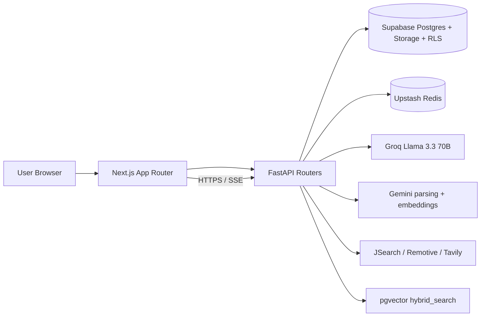

# CareerPilot System Design

**CareerPilot** is a four-pillar career co-pilot built with a CV-grounded RAG core. The current implementation uses a Next.js App Router frontend, a FastAPI backend, Supabase for auth/database/storage/RLS, Gemini for CV parsing and embeddings, Groq for streaming chat, LangGraph for the job hunter workflow, and Upstash Redis for caching.

## 1. Current Product Surface

| Route | Visible label | Purpose |
| --- | --- | --- |
| `/tracker` | My Journey | Daily workspace for Today, Applications, Goals & Tasks, Calendar, and Progress |
| `/jobs` | Jobs | Job search, ranking, and fit scoring |
| `/chat` | AI Assistant | Streaming CV-grounded assistant with session memory |
| `/cv` | Profile | CV upload, parsing, and editable profile intelligence |
| `/cv/preview` | Resume Preview | Generated resume preview and print/export view |
| `/` | Redirect | Authenticated users are redirected to `/tracker` |

## 2. System Overview

The design goal is simple: every recommendation must be grounded in the user's real CV data, not a generic profile.

## 3. End-to-End Data Flow

### 3.1 CV ingestion

1. User uploads a PDF or DOCX from `/cv`.
2. `POST /api/cv/upload` validates file type and size.
3. The backend parses the CV with Gemini-backed parsing and converts it into four canonical sections:
   - `skills`
   - `experience`
   - `education`
   - `projects`
4. The original file is uploaded to Supabase Storage.
5. The backend writes a `cvs` row and builds an editable `profiles` record.
6. Parsed sections are chunked, embedded with Gemini `gemini-embedding-001`, and stored in `cv_chunks` as `vector(768)`.
7. Any stale job scores are invalidated so future fit scores use the new CV.
8. The saved profile also powers the `/cv/preview` resume preview/export route.

### 3.2 Job hunter

1. User searches from `/jobs`.
2. `POST /jobs/hunt` checks Redis cache first.
3. If no cached result exists, the LangGraph job hunter runs:
   - JSearch first
   - Remotive fallback
   - Tavily fallback
4. Raw listings are normalized and stored in `jobs`.
5. Fit score is computed programmatically in `fit_score.py`:
   - section weights: skills 40%, experience 35%, education 15%, projects 10%
   - dense + keyword retrieval via the `hybrid_search` RPC
   - cosine similarity over stored CV embeddings
   - a small role relevance multiplier based on the query
6. Gemini is used only for the one-sentence explanation, not for the numeric score.
7. Jobs are returned sorted by fit score and persisted with score provenance.

### 3.3 AI assistant

1. User chats from `/chat`.
2. The frontend opens a streaming SSE request to the FastAPI chat router.
3. The backend loads the last messages from `chat_messages`.
4. It retrieves CV context with `hybrid_search` over `cv_chunks`.
5. Groq streams the reply token-by-token.
6. Responses are stored back into `chat_messages` and session titles are tracked in `chat_sessions`.
7. The assistant can propose app actions, but tracker/application mutations require explicit user confirmation in the UI.
8. Confirmed actions are validated and executed by the Copilot service before any database mutation occurs.

### 3.4 My Journey

`/tracker` is the daily workspace and has five internal views:

- Today
- Applications
- Goals & Tasks
- Calendar
- Progress

Applications uses the exact lowercase statuses:

`saved -> applied -> interviewing -> offer -> rejected`

The tracker is fed by live data from `applications`, `goals`, `todos`, `nudges`, `progress_snapshots`, and related support tables.

## 4. Core Data Model

| Table | Purpose |
| --- | --- |
| `profiles` | Editable career profile built from the user's active CV |
| `cvs` | Uploaded CV metadata and storage reference |
| `cv_chunks` | Sectioned CV chunks with Gemini embeddings |
| `jobs` | Cached and scored job search results |
| `applications` | Job application tracker entries |
| `chat_sessions` | Durable chat thread metadata |
| `chat_messages` | Conversational memory |
| `goals` | Career goals |
| `todos` | Goal-linked todos and deadlines |
| `nudges` | AI nudges for the tracker |
| `progress_snapshots` | Weekly dashboard history |
| `application_events` | Audit trail for application changes |
| `profile_skill_events` | Skill growth history |
| `career_preferences` | Copilot preference state |
| `copilot_action_events` | Copilot proposal history |
| `copilot_user_state` | Copilot guidance state |

The Copilot layer tracks onboarding state, guidance level, feature exposures, validated route proposals, and confirmed action history.

Key constraints:

- `cv_chunks.section` is one of `skills`, `experience`, `education`, `projects`
- `cv_chunks.embedding` is `vector(768)`
- job fit scores are numeric and stored on the job row
- application statuses are limited to the five values above

## 5. Architecture Boundaries

### Frontend

- Next.js App Router
- Tailwind CSS only
- shadcn/ui components
- dnd-kit for drag and drop
- Recharts for progress charts

### Backend

- FastAPI
- async route handlers
- SSE streaming for chat
- Supabase service-role client on the server
- Copilot validation/execution service for confirmed actions

### External services

- Groq for streaming chat
- Gemini for parsing, embeddings, and short explanation generation
- JSearch, Remotive, and Tavily for job search
- Upstash Redis for caching and rate-limiting support

## 6. Scalability And Bottlenecks

### Current baseline

The current system is optimized for hackathon scale and a relatively small active user base. The main performance win is that the expensive operations are cached or reused:

- raw job search results are cached in Redis
- fit scores are reused when the active CV has not changed
- chat keeps only the most recent messages in memory for prompting

### Main bottlenecks

1. LLM rate limits and latency on Groq and Gemini.
2. CV ingestion latency for large PDF/DOCX files.
3. Vector search growth as `cv_chunks` expands.
4. Supabase connection pressure if concurrency rises sharply.

### Mitigations

- reuse scored jobs when `scored_cv_id` and `fit_score_version` still match
- keep Redis TTLs on raw job searches
- move heavy ingestion to background jobs if traffic grows
- keep `hybrid_search` as the single retrieval path
- use pooling and sharding only if the dataset grows much larger
- persist Copilot state in Supabase so guidance survives across sessions

### Cost estimate

CareerPilot is designed to run the hackathon demo on free tiers. At real scale, the main cost driver becomes LLM and embedding usage, not the Next.js or FastAPI app itself.

| Scale | Expected monthly cost | Approx. cost/user/month | Notes |
| --- | ---: | ---: | --- |
| Demo / judging | `$0` | `$0` | Uses free tiers and local development/deployment quotas |
| 100 active users | `$0-$25` | `$0-$0.25` | Mostly still free-tier unless LLM quotas are exceeded |
| 1,000 active users | `$50-$150` | `$0.05-$0.15` | Likely needs paid hosting/database and more API quota |
| 10,000 active users | `$500-$1,500` | `$0.05-$0.15` | Requires paid API capacity, database scaling, and worker/background processing |

The 10,000-user estimate assumes caching is effective, repeated job searches are reused, only active users trigger LLM calls, and CV ingestion is not repeated daily. Without caching or with very heavy chat usage, LLM spend would become the dominant variable.

## 7. Security Design

| Concern | Mechanism |
| --- | --- |
| Authentication | Supabase Auth |
| Authorization | Row Level Security on user tables |
| API keys | Environment variables only, never committed |
| CV file access | Private Supabase Storage with signed URLs |
| Prompt injection | System prompt stays fixed; user content is treated as data |
| CORS | FastAPI CORS middleware |
| Confirmed mutations | Copilot actions are validated server-side before execution |

## 8. Submission Readiness

This document matches the current codebase design:

- CV upload uses Gemini parsing and Gemini embeddings
- job search uses JSearch -> Remotive -> Tavily
- fit scoring is programmatic and section-weighted
- chat is streamed from Groq
- My Journey uses the current lowercase application statuses
- Copilot preferences and action state are persisted in Supabase
- Resume preview is documented as a real route

--- 

End of document.
